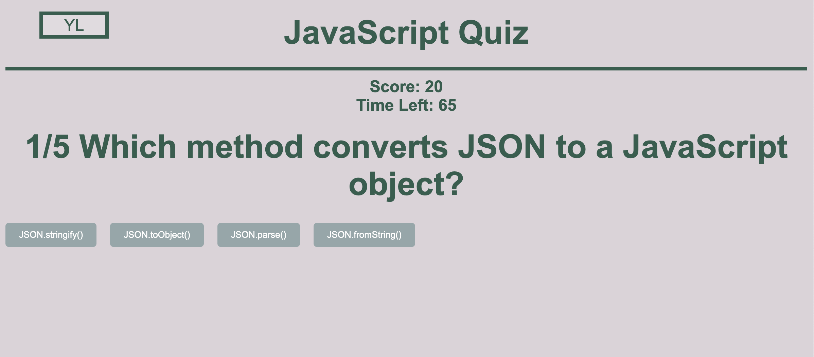

# javascript-quiz
A simple quiz application built with JavaScript.

## Links 
*[GitHub Repo](https://github.com/ilavine/javascript-quiz)*

*[Deployed App](https://ilavine.github.io/javascript-quiz/)*
## Features
* Multiple choice questions with 4 answer options
* Timer countdown for each question
* Score tracking and display at the end of the quiz
* User can enter their name to start the quiz
* User can see their progress through the quiz
* User can see the correct answer after each question
* User can see their score and time left after completing the quiz

## Technologies Used
* HTML
* CSS
* JavaScript

## Mock-Up

